# Token Factor Dashboard

An interactive [Dash](https://dash.plotly.com/) app for studying what drives crypto token prices
over the last 365 days: **token buybacks**, **protocol revenue**, **trading volume**, the
**overall market** and the token's **sector**, both for one token at a time and **across
tokens** (pairs, coin-level scatter, correlations).

The app covers 89 tokens: the top 50 by market cap (excluding stablecoins, BNB and wrapped /
liquid-staking / tokenized real-world assets), plus the largest tokens with buyback data until
50 tokens have buybacks. A snapshot of all data is included in `data/`, so the app runs straight
away without any API key.

**Contents**

- [Quick start](#quick-start)
- [The app at a glance](#the-app-at-a-glance)
- [Global controls](#global-controls)
- [Individual page](#individual-page): [abnormal events](#abnormal-events) ·
  [time series](#time-series) · [scatter](#scatter) · [beta ranking](#beta-ranking) ·
  [multi-factor regression](#multi-factor-regression-two-steps) ·
  [factor correlations](#factor-correlations)
- [Cross-Section page](#cross-section-page): [spread](#spread-between-coins) ·
  [spread regression](#multi-factor-regression-on-the-spread) · [coin scatter](#coin-scatter) ·
  [coin metrics](#coin-metrics) · [return correlations](#return-correlations)
- [Definitions and derivations](#definitions-and-derivations)
- [Data](#data) · [Method notes and caveats](#method-notes-and-caveats) ·
  [Project structure](#project-structure)

## Quick start

```
pip install -r requirements.txt
python app.py             # open http://127.0.0.1:8050
```

To refresh the data (about 15 minutes):

```
echo "COINGECKO_API_KEY=<your free CoinGecko Demo key>" > .env
python fetch_data.py                    # everything
python fetch_data.py --categories-only  # only coin categories (~4 min)
python fetch_data.py --revenue-only     # only DeFiLlama revenue (~2 min)
```

A free Demo key is available at <https://www.coingecko.com/en/api>. The key is read from `.env`
(git-ignored) or from the `COINGECKO_API_KEY` environment variable. No VPN is needed: Binance data
comes from Binance's public market-data mirror (`data-api.binance.vision`), which is not
geo-blocked in the US. Restart `python app.py` after refreshing the data.

<!-- deploy:start -->
### Deploying (Render)

The app runs as a Python **Web Service** (not a Static Site). It only reads the saved data in
`data/`, so no API key or environment variables are needed on the server.

| Setting | Value |
|---|---|
| Build Command | `pip install -r requirements.txt` |
| Start Command | `gunicorn app:server` |

To update the deployed data, run `fetch_data.py` locally, commit the new `data/` files and push;
Render redeploys automatically. On Render's free tier the service sleeps after ~15 minutes without
visitors, so the first load afterwards takes up to a minute.
<!-- deploy:end -->

## The app at a glance

| Page | Question it answers | Sections |
|---|---|---|
| **Individual** (`/`) | What moves *this* token's price? | Abnormal events · Time series · Scatter · Beta ranking · Multi-factor regression (two steps) · Factor correlations |
| **Cross-Section** (`/cross-section`) | How do tokens move *relative to each other*? | Spread between coins (pairs) · Multi-factor regression on the spread · Coin scatter · Coin metrics · Return correlations |

While a chart is being recomputed, its previous version stays visible but greyed out under an
**"Updating…"** badge, and every section header carries a badge naming the token (or pair /
universe) it shows, so a stale chart is never mistaken for the new settings.

## Global controls

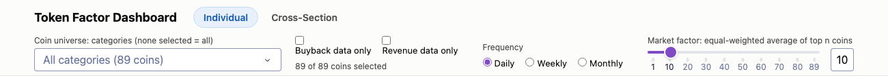

The sticky bar at the top is shared by both pages.

- **Coin universe**: pick one or more business-type categories (e.g. Lending, DEX & perps,
  Layer 1; see [coin categories](#coin-categories)); none selected means all 89 coins.
  **Buyback data only** / **Revenue data only** narrow it to coins with that data. Only coins in
  the universe can be picked further down, and tables, scatters and heatmaps only show them.
  The market index is never filtered: it is always the top *n* of all coins.
- **Frequency**: daily, weekly (Monday–Sunday) or monthly (calendar months) data. Only complete
  periods are used. Prices are the period's last close; volume, buybacks and revenue are summed.
- **Market factor n**: how many of the largest tokens make up the
  [market index](#market-index) (1 to 89, default 10).

## Individual page

Pick a **token** at the top of the page (only coins in the universe are listed; tokens without
buyback data are marked). Options that need buyback or revenue data are disabled for tokens that
don't have it.

### Abnormal events

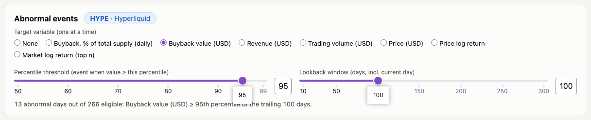

Flags unusual days for one chosen variable (buyback % of supply, buyback USD, revenue USD,
trading volume, price, price log return or market log return). A day is an **event** when its
value is at or above the *P*-th percentile of the trailing *L* days, the current day included:

$$\text{event}_t \iff x_t \ge Q_P\left(x_{t-L+1}, \dots, x_t\right)$$

*P* and *L* are set with the sliders. The first *L* − 1 days have no full window and can never be
events. Events are always found on daily data; in weekly / monthly mode a period is an event
period if it contains an event day. Events appear as red vertical lines on the time series and red
diamonds on the scatter.

### Time series

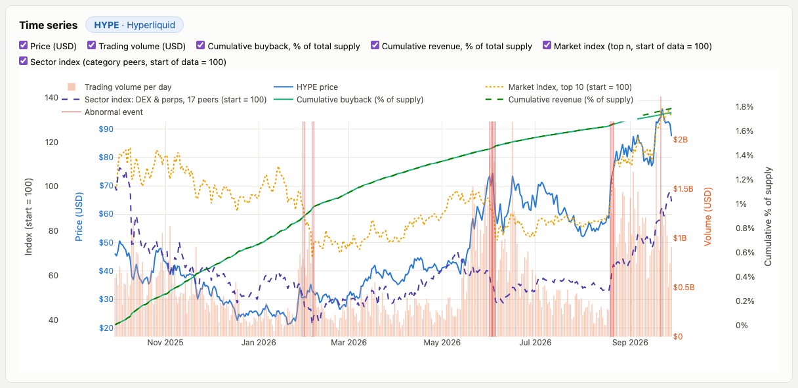

Overlays, each on its own y-axis colored like its line:

| Series | What it is |
|---|---|
| Price (USD) | daily close; the axis switches to **log scale** automatically when the price spans 20× or more |
| Trading volume (USD) | bars, per period |
| Cumulative buyback, % of total supply | running sum of [buybacks as % of supply](#buybacks-and-revenue-as--of-supply) |
| Cumulative revenue, % of total supply | the same for revenue (dashed); the gap to the buyback line is revenue the protocol keeps |
| Market index (start = 100) | see [market index](#market-index) |
| Sector index (start = 100) | see [sector index](#sector-index) |

The market and sector indices share one axis and are **not** rebased to the token: a given date
has the same index value on every token's chart.

### Scatter

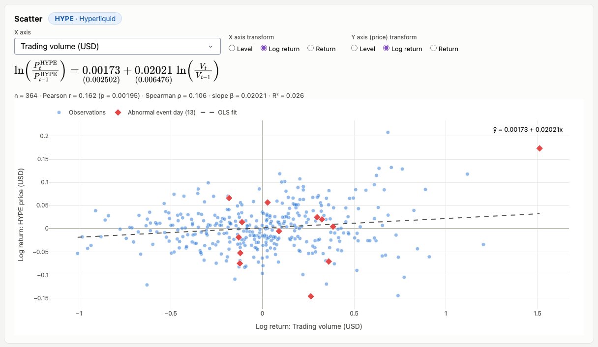

The token's price (y) against one factor (x): buyback (% of supply or USD), revenue (% of supply
or USD), trading volume or the market. Each axis has its own transform:

| Transform | Formula |
|---|---|
| Level | $x_t$ |
| Log return | $\ln(x_t / x_{t-1})$ |
| Return | $x_t / x_{t-1} - 1$ |

Buyback and revenue returns use $1 + x_t$ in place of $x_t$, so days with zero stay defined. The
fitted OLS line $y = \alpha + \beta x$ is written out above the chart with standard errors in
parentheses, plus Pearson / Spearman correlations and R². Abnormal-event days are highlighted.
"Level" on the market axis uses the market index; the return options use the market's average
return.

### Beta ranking

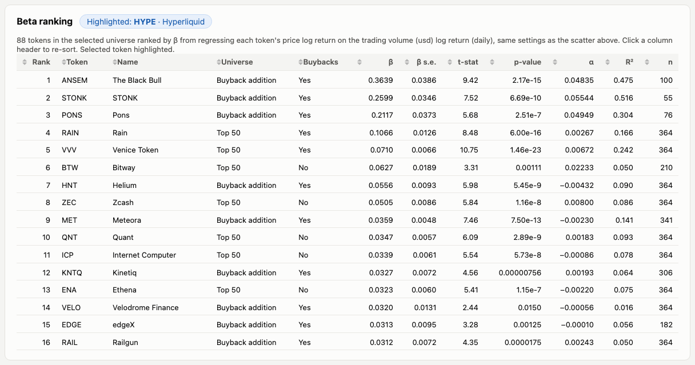

Repeats the scatter's regression (same x factor, transforms, frequency and market *n*) for every
token in the universe and ranks them by β, with standard error, t-stat, p-value, α, R² and the
number of observations. The selected token is highlighted. Buyback / revenue factors only include
tokens that have that data.

### Multi-factor regression (two steps)

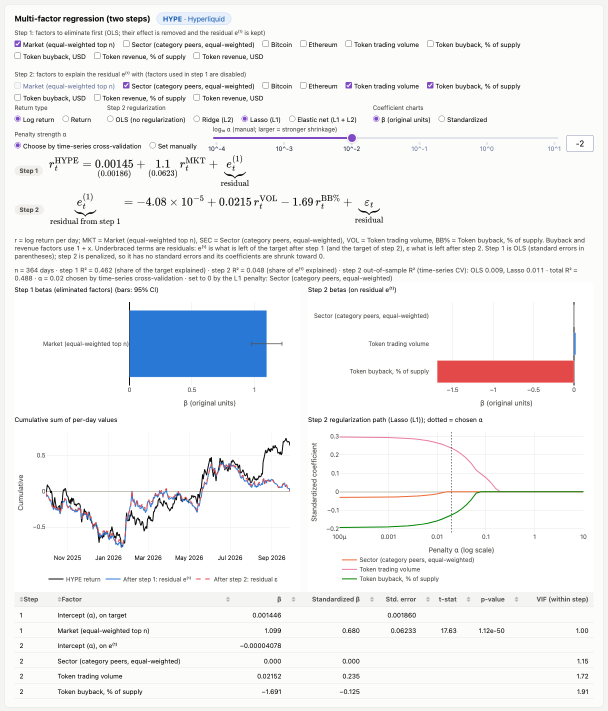

Explains the token's per-period return with several factors at once, in **two steps** that
choose from the same factor list:

1. **Step 1, eliminate.** OLS of the target on the factors whose effect should be removed first
   (e.g. the market or Bitcoin). The residual $e^{(1)}$ is kept:

   $$r_t = \alpha_1 + \sum_{k \in S_1} \beta_k x_{k,t} + e^{(1)}_t$$

   Step 1 is always OLS, so $e^{(1)}$ is exactly uncorrelated with the eliminated factors.
2. **Step 2, explain.** The residual is regressed on the factors to study (factors used in step 1
   are disabled here):

   $$e^{(1)}_t = \alpha_2 + \sum_{k \in S_2} \gamma_k x_{k,t} + \varepsilon_t$$

**Factors**: market (top *n*), [sector](#sector-index) (the token's category peers, excluding the
token itself), Bitcoin, Ethereum, and the token's own trading volume, buybacks and revenue (each
as % of supply or in USD). All enter as per-period log (or simple) returns.

**Shown**: both fitted equations (standard errors under the OLS coefficients; the residuals
$e^{(1)}$ and $\varepsilon$ are marked with a brace), a bar chart of each step's betas (original
units or [standardized](#standardized-coefficients), with 95% confidence intervals for OLS), the
cumulative target, $e^{(1)}$ and $\varepsilon$ over time, and a table with t-stats, p-values and
[VIF](#vif). The stats line reports

$$R^2_{\text{step 1}} = 1 - \frac{\mathrm{Var}(e^{(1)})}{\mathrm{Var}(r)}, \qquad
R^2_{\text{step 2}} = 1 - \frac{\mathrm{Var}(\varepsilon)}{\mathrm{Var}(e^{(1)})}, \qquad
R^2_{\text{total}} = 1 - \frac{\mathrm{Var}(\varepsilon)}{\mathrm{Var}(r)}.$$

**Step-2 regularization**: OLS, **Ridge** (L2; shrinks all coefficients and stabilizes correlated
factors), **Lasso** (L1; can set coefficients exactly to 0, i.e. selects factors) or **Elastic
net** (a mix; the L1 share is adjustable). See [regularization](#regularization-and-cross-validation)
for how the penalty α is set or chosen. The **regularization path** chart shows every step-2
coefficient as α grows, with the chosen α dotted.

### Factor correlations

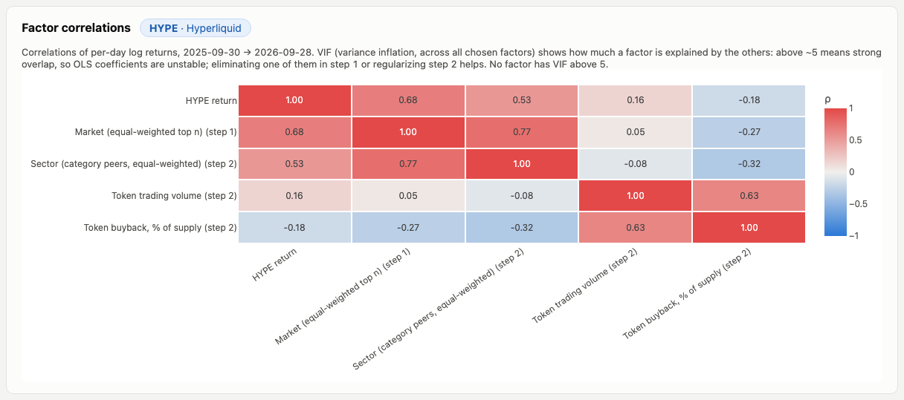

A heatmap of correlations between the target and the factors chosen in both steps, plus the
[VIF](#vif) of each factor. High VIF (above ~5; typical for market, BTC and ETH together) means a
factor largely duplicates the others, so its OLS coefficient is unstable. Eliminating one of them
in step 1, or regularizing step 2, addresses this.

## Cross-Section page

### Spread between coins

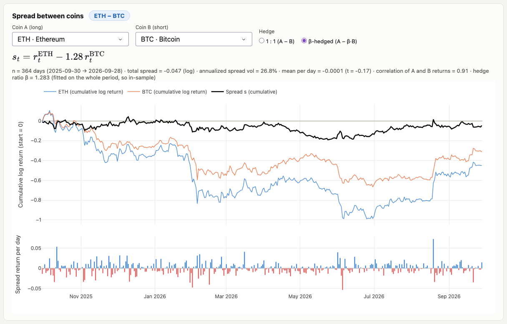

The pair trade "long coin A, short coin B". The chart shows the cumulative spread (black) with the
two coins' own cumulative log returns for context, and the per-period spread returns underneath:

$$s_t = r^{A}_t - h r^{B}_t, \qquad h = 1 \quad \text{(1 : 1), or} \quad h = \beta \quad \text{(β-hedged)}$$

See [hedge ratio](#hedge-ratio) for how β is estimated and why it minimizes the spread's variance.

The stats line gives the total spread, its annualized volatility, the mean per period with its
t-stat, the correlation of the two legs and (if β-hedged) β.

### Multi-factor regression on the spread

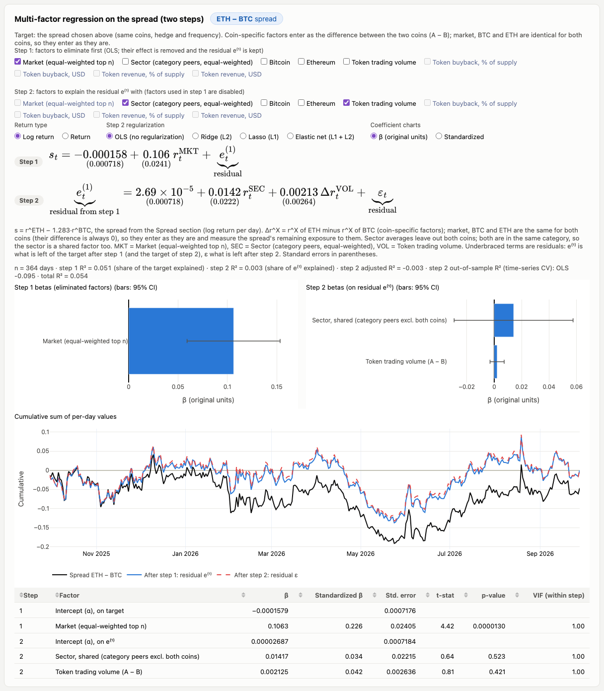

The same [two-step regression](#multi-factor-regression-two-steps) as on the Individual page,
with the spread above (same coins, hedge and frequency) as the target. Factors are adapted to a
pair:

- **Coin-specific factors** (volume, buybacks, revenue) enter as the **difference** between the
  two coins, $\Delta x_t = x^{A}_t - x^{B}_t$, and need data for both coins.
- **Market, BTC and ETH** are the same series for both coins, so their difference is always 0.
  They enter as they are and measure how much exposure to them the spread still has (removing the
  market in step 1 is the default).
- **Sector** averages leave out **both** coins. Otherwise A's sector average contains B and B's
  contains A, and their difference would be a scaled copy of the spread itself:
  $\tfrac{1}{N-1}(r^B - r^A)$. If both coins are in the same category the two averages coincide,
  so the sector enters once, as a shared factor; otherwise as A − B.

### Coin scatter

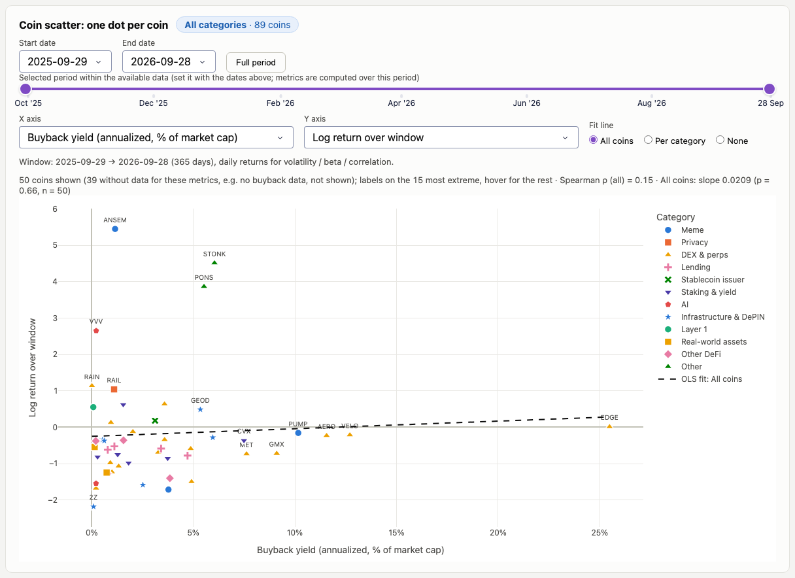

One dot per coin in the universe, colored and shaped by category, with any two
[coin metrics](#coin-metric-definitions) on the axes, computed over a date window. Pick the
window's **start and end dates** with the two calendar pickers ("Full period" resets them); the
bar below is read-only and shows the picked period within the available data. The fit line can be
one OLS fit across all coins or one per category, to see whether coins of the same business type
behave differently. With more than 30 coins only the 15 most extreme dots are labelled; hover for
the rest.

Useful x-axes: **buyback yield** or **revenue yield** (do coins that return more to holders, or
earn more, perform better, and does that differ by business type?), **payout ratio**, **market
beta** (do riskier coins earn more?), **size** and **turnover**. Both axes use the same window, so
the scatter describes that period; it is not a prediction.

### Coin metrics

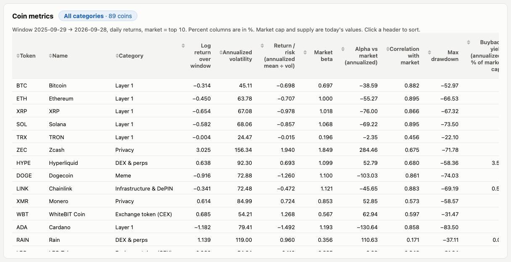

A sortable table of every [coin metric](#coin-metric-definitions) for the coins in the universe,
over the same window as the scatter.

### Return correlations

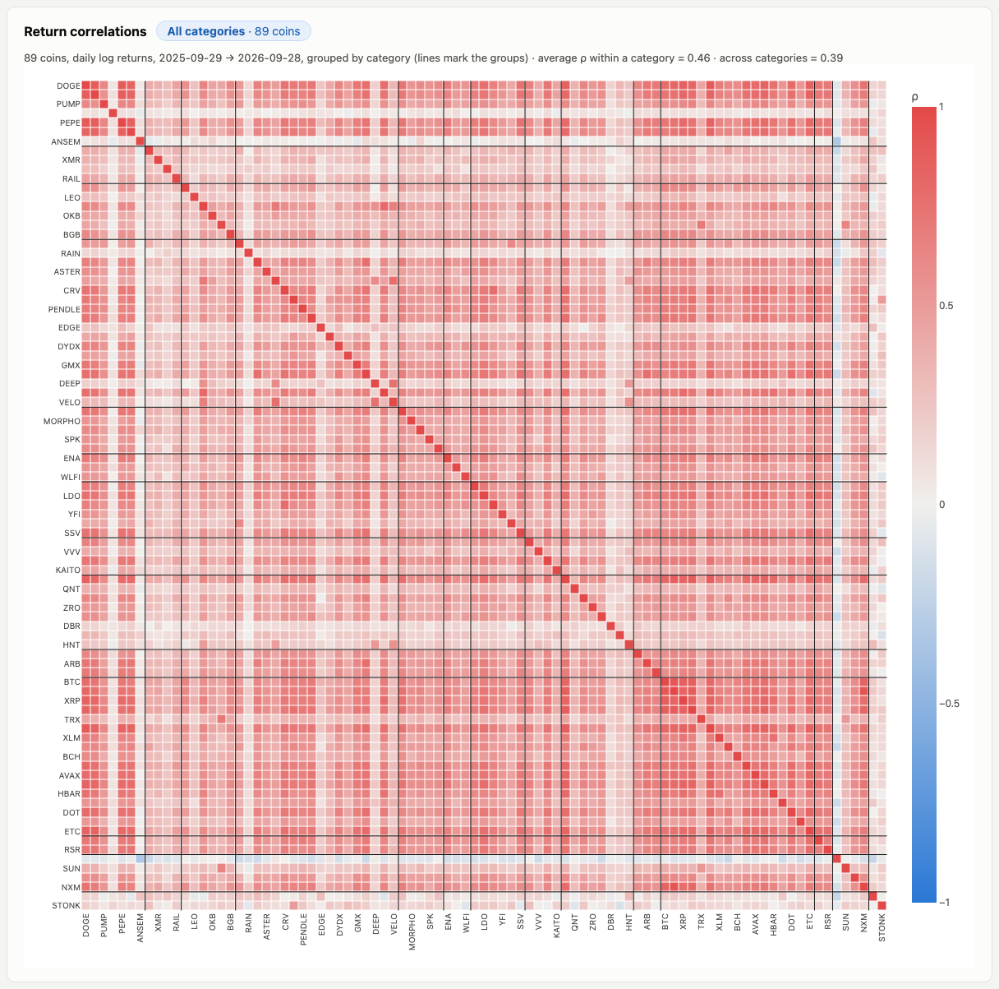

Pairwise correlations of per-period log returns over the window, grouped by category (lines
separate the groups), with the average correlation within a category versus across categories.
Pairs need at least 10 overlapping periods.

## Definitions and derivations

### Returns

For a price (or flow) series $x_t$ at the chosen frequency:

$$r_t = \ln\frac{x_t}{x_{t-1}} \quad \text{(log return)}, \qquad R_t = \frac{x_t}{x_{t-1}} - 1 \quad \text{(simple return)}.$$

Buyback and revenue series contain zeros, so their returns use $1 + x_t$ in place of $x_t$. On the
rare days a protocol reports negative revenue (incentives above fees) the value is not defined and
that day is skipped.

### Market index

An equal-weighted index of the top *n* coins by **current** market cap, rebalanced every period.
The market return is the plain average of the coins' simple returns, and the index compounds it
from 100 at the start of the data:

$$R^{\text{mkt}}_t = \frac{1}{n_t} \sum_{i=1}^{n_t} \left(\frac{P_{i,t}}{P_{i,t-1}} - 1\right), \qquad
I_t = I_{t-1} (1 + R^{\text{mkt}}_t), \quad I_0 = 100.$$

$n_t \le n$ is the number of top-*n* coins with prices on that date, so coins listed partway
through the year join when their history starts. Equal weights mean a 1% move in the 10th-largest
coin counts as much as a 1% move in Bitcoin. Example with *n* = 3 (BTC, ETH, XRP): if their returns
on a day are −0.23%, −1.66% and −1.16%, the market return is −1.02% and an index at 100 falls to
98.98. Regressions use the average **log** return when log returns are selected.

### Sector index

The same construction as the market index, over the token's **category peers**, excluding the
token itself (so the sector factor is not partly the token):

$$R^{\text{sec}(i)}_t = \frac{1}{|C_i| - 1} \sum_{j \in C_i, j \ne i} R_{j,t}, \qquad
I^{\text{sec}(i)}_t = I^{\text{sec}(i)}_{t-1} (1 + R^{\text{sec}(i)}_t), \quad I_0 = 100,$$

where $C_i$ is the token's category. In a pair regression both coins are excluded (see
[above](#multi-factor-regression-on-the-spread)).

### Buybacks and revenue as % of supply

DeFiLlama reports USD amounts per day. To compare them across tokens and with each other they are
converted to tokens at that day's price and expressed as a share of the **current** total supply
(historical supply isn't available):

$$\text{buyback pct of supply}_t = \frac{B^{\text{USD}}_t / P_t}{\text{supply}} \times 100, \qquad
\text{revenue pct of supply}_t = \frac{\text{Rev}^{\text{USD}}_t / P_t}{\text{supply}} \times 100.$$

**Revenue** is the part of fees the protocol (or chain) keeps; **holders revenue**, the buyback
proxy, is the part of revenue paid out to token holders, so buybacks ≤ revenue for every coin.

### Hedge ratio

The β-hedged pair uses the OLS slope of A's returns on B's over the whole period:

$$\beta = \frac{\mathrm{Cov}(r^A, r^B)}{\mathrm{Var}(r^B)} = \rho_{AB} \frac{\sigma_A}{\sigma_B}.$$

It is the hedge with the **lowest spread variance**. The variance of the spread,

$$\mathrm{Var}(r^A - h r^B) = \sigma_A^2 - 2h\mathrm{Cov}(r^A, r^B) + h^2\sigma_B^2,$$

is minimized where its derivative in $h$ is zero, i.e. at $h = \beta$; the resulting spread is
uncorrelated with B. Example, ETH − BTC
(daily): β = 1.28, and the spread's annualized volatility is 63.8% unhedged, 29.7% at 1 : 1 and
26.8% at β. β is estimated on the same data it hedges, so it is the best hedge in hindsight, not a
forecast.

### Standardized coefficients

$$\beta^{\text{std}}_k = \beta_k  \frac{\sigma_{x_k}}{\sigma_y},$$

the change in y (in standard deviations) per one-standard-deviation move in the factor, which
makes factors with different units comparable.

### VIF

The variance inflation factor of factor *k* comes from regressing it on the other chosen factors:

$$\text{VIF}_k = \frac{1}{1 - R^2_k}.$$

It measures how much the variance of $\hat\beta_k$ is inflated by overlap with the other factors.
VIF = 1 means no overlap; above ~5 the coefficient is unreliable.

### Regularization and cross-validation

Before penalizing, factors and target are standardized (mean 0, standard deviation 1) so the
penalty treats every factor equally; coefficients are converted back to original units for display.
One penalty scale is used for all methods (scikit-learn's elastic-net objective):

$$\min_{w}~\frac{1}{2n}\lVert y - Xw\rVert^2 + \alpha \lambda \lVert w\rVert_1 + \frac{\alpha (1-\lambda)}{2}\lVert w\rVert_2^2,$$

with $\lambda$ = 1 for Lasso, 0 for Ridge and the chosen L1 share for Elastic net. α is either set
with the slider or chosen by **time-series cross-validation**: up to 5 expanding windows, each
training on the past and testing on the next block of periods, picking the α with the best
average out-of-sample R². The out-of-sample R² of OLS and of the chosen model are both shown, so
you can see whether regularization actually helps. Monthly data (≈ 11 periods) is too short to
cross-validate; the manual α is used then.

### Coin metric definitions

All computed over the selected window; returns use the selected frequency.

| Metric | Definition |
|---|---|
| Log return | $\ln(P_{\text{end}} / P_{\text{start}})$ |
| Annualized volatility | std of per-period log returns × $\sqrt{\text{periods per year}}$ (365 / 52 / 12) |
| Return / risk | annualized mean log return ÷ annualized volatility |
| Market beta, alpha, correlation | OLS of the coin's per-period log returns on the market's; alpha annualized; needs ≥ 10 periods |
| Max drawdown | largest fall from a running peak of daily closes, $\min_t (P_t / \max_{s \le t} P_s) - 1$ |
| Buyback yield | buybacks (USD) over the window × 365 / days ÷ current market cap |
| Buyback % of supply | tokens bought back over the window ÷ current total supply |
| Revenue yield | revenue (USD) over the window × 365 / days ÷ current market cap |
| Payout ratio | holders revenue ÷ revenue over the window (share of revenue paid to holders) |
| Turnover | average daily volume ÷ current market cap |
| Size | $\log_{10}$ of current market cap |

## Data

### Sources

| Series | Source |
|---|---|
| Token universe, market cap, supply, categories | CoinGecko `/coins/markets`, `/coins/{id}` (category lists are also used for the exclusions) |
| Daily close price & volume | Binance spot `<SYMBOL>USDT` klines (close + USDT quote volume). Falls back to CoinGecko `market_chart` when there is no Binance pair, Binance covers < 95% of the window, or Binance's price differs from CoinGecko's by > 10% (a different token with the same symbol) |
| Daily buybacks (USD) | DeFiLlama `dailyHoldersRevenue`, summed across a token's protocols |
| Daily revenue (USD) | DeFiLlama `dailyRevenue`, summed across a token's protocols; for coins without a protocol (L1/L2 chains) the chain's revenue, matched via DeFiLlama's chain list. Sources under USD 100k over the last year are ignored |

### How the universe is built

1. Take the largest tokens by market cap and drop stablecoins, BNB, wrapped, liquid-staking and
   tokenized-asset tokens. Also drop tokens whose annualized volatility is below 10%, which catches
   stable-value assets missing from those categories. Keep the first 50.
2. Find tokens whose DeFiLlama holders revenue was at least USD 100k over the last year and add the
   largest of them by market cap until 50 tokens in the universe have buyback data.

Of the 89 coins, 50 have buyback data and 64 have revenue data (54 protocol, 10 chain).

### Coin categories

CoinGecko tags each coin with many overlapping categories (ecosystems, index memberships, …). Each
coin is given **one business-type category**: the first rule in `config.CATEGORY_RULES` that
matches one of its tags, so specific business types win over broad ones (a perpetuals exchange
that also runs its own chain counts as "DEX & perps", not "Layer 1"). `config.CATEGORY_OVERRIDES`
fixes the few coins the rules get wrong (e.g. LINK is an oracle, not a real-world-asset token).
The rule order also fixes each category's chart color, so colors never change with the filter.

The 14 categories: Meme, Privacy, Exchange token (CEX), DEX & perps, Lending, Stablecoin issuer,
Staking & yield, AI, Infrastructure & DePIN, Layer 2, Layer 1, Real-world assets, Other DeFi,
Other.

### Files in `data/`

| File | Contents |
|---|---|
| `universe.csv` | One row per token: id, symbol, name, market cap and rank, supply, `segment` (`top` = top 50, `buyback` = added for buyback data), `has_buybacks`, DeFiLlama slugs, price source |
| `prices.parquet` | Daily `date`, `price` (USD close), `volume_usd`, `id` |
| `buybacks.parquet` | Daily `date`, `buyback_usd`, `id` (tokens with buyback data only) |
| `revenue.parquet` | Daily `date`, `revenue_usd`, `id` (coins with revenue data only) |
| `revenue_sources.json` | Per coin: DeFiLlama slugs used, `kind` (`protocol` or `chain`) and last-year total |
| `categories.json` | Each coin's raw CoinGecko category tags |
| `meta.json` | When the data was fetched (UTC) and the fetch settings |
| `excluded_ids.json` | Cached list of excluded CoinGecko ids, used if a category request fails |

All dates are UTC. Each row is a completed trading day; the window is the 365 days before the
fetch.

## Method notes and caveats

- **Buyback proxy**: DeFiLlama's holders revenue stands in for buybacks. For some protocols (e.g.
  SKY, LINK staking) it also includes staking distributions or burns.
- **Current values**: market cap and supply exist only as today's values, so buyback / revenue
  yields, turnover, size and "% of supply" use today's figures even for older periods.
- **Universe by today's market cap**: the top *n* (market index) and the universe are chosen by
  current market cap, which slightly favours coins that did well during the year.
- **In-sample estimates**: the hedge ratio and all regressions are fitted on the whole period they
  describe. The time-series cross-validation R² is the only out-of-sample measure.
- **Levels vs returns**: regressing one level on another (e.g. price on the market index) can show
  a relationship that isn't there because both drift over time. Prefer returns for inference.
- **Minimum data**: OLS needs at least 10 observations; beta, alpha and correlation need at least
  10 periods in the window.

## Project structure

```
app.py                  App shell: page navigation, global controls (coin universe, frequency, market n)
views/individual.py     Individual page layout and callbacks
views/cross_section.py  Cross-Section page layout and callbacks
views/regression.py     Two-step multi-factor regression + factor correlations, used by both pages
views/common.py         Shared styling, chart helpers, category colors
analytics.py            Cached data, resampling, returns, market index, regressions, abnormal events
cross_section.py        Coin categories, pair spreads, per-coin metrics, correlations
factors.py              Factor construction (token / pair), two-step fit, OLS / ridge / lasso / elastic net, CV, VIF
fetch_data.py           Downloads universe, prices, buybacks, revenue and categories into data/
config.py               Settings: universe sizes, exclusions, category rules, thresholds, API URLs
data_sources/           Small clients for CoinGecko, Binance and DeFiLlama (shared retry logic in http.py)
assets/style.css        Page styling (loaded automatically by Dash)
data/                   Cached data snapshot used by the app
docs/images/            Screenshots used in this README
```

## Data credits

Market data and categories from [CoinGecko](https://www.coingecko.com), prices and volume from
[Binance](https://www.binance.com), and holders-revenue (buyback) and revenue data from
[DeFiLlama](https://defillama.com). Each provider's terms of use apply to its data.
